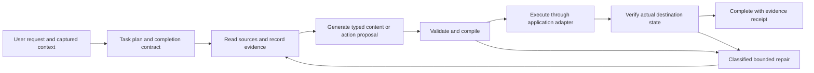

# Scribble reliability audit and hardening plan

Implementation progress and explicit remaining gates are tracked in [HARDENING_IMPLEMENTATION.md](HARDENING_IMPLEMENTATION.md). The audit below describes the pre-implementation application revision.

Date: 2026-09-05. Audited application commit: `3ad74ba31c97cb71634a96fdb0c4e60e78dd83a7`.

This is an investigation and implementation plan. Application fixes described below have **not** been implemented by this audit. The existing successful CI run is [33959538760](https://github.com/datap0nd/scribble/actions/runs/33959538760); it does not establish that the reported workflows work with native Office and the user's model endpoint.

## 1. Findings and confidence

The failures are not one bad prompt. They cross browser perception, mailbox enumeration, source representation, model compatibility, recovery, and release validation. More instructions and larger step limits cannot repair these boundaries.

| Reported failure | Finding | Confidence |
| --- | --- | --- |
| Samsung condition choices cannot be clicked | All three condition inputs are transparent Ant Design checkboxes. Scribble rejects opacity-zero inputs, and its selector excludes their visible card wrappers. | **Reproduced on the live site**, with the current discovery predicate evaluated against its DOM. |
| Morning summary repeats zero results and pauses | Empty pages can advance the mailbox cursor through 100 nonmatching rows without changing the returned payload. The orchestration controller mistakes identical payloads for no progress. | **Confirmed code defect; rule reproduction**, not a replay against the photographed mailbox. |
| Slide numbers `1, 2, 3` rejected | The validator extracts numbers from serialized displayed fields without distinguishing list ordinals from factual quantities. | **Confirmed rule defect**; whether each photographed number was an ordinal needs the original payload. |
| Slide evidence repeatedly rejected | One exact contiguous quote must match a textual corpus and support every number. Whitespace changes, omitted metadata, and image-only evidence can fail before review. | **Confirmed restrictions and source gaps**; individual failures require preserved source/payload replay. |
| Unsupported strategy claims rejected | The photographed review identifies specific content not supported by the supplied evidence. These rejections may be correct. | **Observed in the supplied screenshots**; do not disable grounding to force success. |
| Same website fetched repeatedly | The Office fetch tool has no per-task response cache or typed duplicate-read policy. Repetition guidance is only prose. Every non-success HTTP status is also described as likely bot blocking, including 404. | **Confirmed code weaknesses**. Six fetches of the same hostname do not prove six identical URLs. |
| HTTP 200 with null content and no tool calls | The photographed endpoint response contains no usable completion. The current client retries inference once, then preserves a failure. That handles the symptom, not its origin. | **Response failure observed**. Parser/template, stop tokens, context limits, or serving bugs remain hypotheses. |
| Wrong recovery banner appears beside another request | Outlook does not clear the previous pending-recovery banner when starting a fresh request. Actual resume requires an explicit resume state. | **Confirmed stale-display path**; backend task contamination is not established. |
| App handoffs pass tests but fail real use | Existing tests run production dispatch/writers against application doubles and scripted LLM responses. Office-to-Chrome opens a URL; it does not continue the task there. | **Confirmed test and capability limitations**. |

### Live Samsung investigation

I navigated [the live UAE trade-in site](https://www.samsungtradein.ae/ae-en/) through Mobile Phones → Galaxy Z Fold8 | Flip8 → Galaxy Z Fold 8 → Mobile Phone → Apple → iPhone 16 Pro (2024) → 256 GB. Storage was a test choice. The condition screen displayed Flawless, Average, and Below Average as text, with unnamed checkboxes.

Each input was `<input type="checkbox" class="ant-checkbox-input" value="">`: 16 × 16 pixels, `display: block`, `visibility: visible`, **`opacity: 0`**. Its associated label contained no text; the condition name was in a separate span inside the same card. The visible checkmark was another span. The surrounding `div.custom-store-drop-off-item` had a pointer cursor but no role or tabindex.

Applying Scribble's current selector and visibility test to each card found one candidate and retained **zero**. Clicking the visible Flawless text succeeded and produced an estimated value. No final trade-in submission or personal-data entry occurred. This establishes the condition discovery failure without assuming the model was confused by an image. [Machine-readable observation](docs/audits/2026-09-05/browser-observation.json).

The root URL returned a transient CloudFront 504; the canonical `www` URL worked. Intermediate product steps briefly showed empty lists while loading. Both belong in navigation diagnostics, separately from control discovery.

**Implementation anchors:** `src/Scribble.BrowserExtension/sidepanel.js:2009` (visibility), `:2213` (candidate selector), `:2039` (names), `:1963` (condition coverage), `:1680` (condition decision matching). Repair semantics and control families, not hard-coded Samsung text or prices.

### Why the Outlook regression is plausible even with correct dates

`MailboxPageCursor.OpenNextFolder` sends only the free-text filter to `GetTable`; an empty query reads the whole folder. Date and unread predicates run after each item is captured. `ReadAsync` yields after scanning 100 rows. No scan position/count reaches the model or progress detector. See `src/Scribble/Outlook/MailboxPageCursor.cs:58` and `:73`.

The host returns the same cursor token, empty results, and `enumeration_complete=false` for successive empty pages (`MailboxToolHost.cs:294`). `TaskContextManager.RecordExchange` compares function arguments and result content, increments a stagnation counter, and pauses at six repetitions (`TaskContextManager.cs:254`). A synthetic sequence with 900 nonmatching rows and the first match at row 901 pauses after eight calls/800 rows when the initial call differs from the continuation calls. The cursor was doing useful work.

The [source-guarded rule reproduction](docs/audits/2026-09-05/reproduce-rules.ps1) also demonstrates ordinal-number rejection and an exact-quote failure caused only by a newline. It does **not** execute the production add-in, a model, or native Outlook.

The screenshot alone cannot prove there were matching unread messages in its window. Timestamp parsing currently converts offset-qualified inputs to local time; that is not by itself a timezone bug. Tests must establish true expected matches, UTC/local conversion, and inclusive boundaries.

## 2. What allowed these failures to escape

1. **The Samsung fixture differs at the failing detail.** `tests/BrowserExtensionE2E/fixtures/operator.html:23` uses a visible plain checkbox. `operator.spec.js:134` checks discovery, but performs the journey through known Playwright selectors instead of Scribble's complete action path. Its condition click bypasses the extension's action and verification layers.
2. **The large-mailbox test is dense.** `tests/GuardrailTests/ScaleTaskTests.cs:27` creates 500/1,000 matching messages. Its paging loop does not feed every exchange into `TaskContextManager.RecordExchange`. It therefore misses the interaction between sparse pages and stagnation detection.
3. **Cross-app tests prove simulated dispatch.** `CrossAppFixture.cs:63` exports a synthetic bitmap; `Program.cs:7703` and `:7762` use scripted approvals. These are useful contract tests, but cannot prove real model argument quality, native slide layout, or Office startup. [Existing limitation record](CROSS_APPLICATION_TESTING.md).
4. **Native acceptance was unresolved.** The earlier development-machine PowerPoint activation failed with `0x80080005`, and native Outlook was unavailable. Those results must prevent native-certification claims, not be replaced by successful doubles.
5. **Diagnostics lose the important tail.** `DiagnosticsRecorder` retains only the first 24 events for each of five requests, with 300-character lines. A failure at step 60 can occur after event recording has stopped. There is no complete, automatically assembled replay bundle joining the model, tool, browser, and Office evidence.
6. **Release promotion follows build success.** The current workflow publishes the continuous installer after build/fixture gates. A successful compile is being used as a stronger signal than it supports.

## 3. Target execution architecture

Keep C#/.NET Framework host integration and Chrome's local extension. Refactor shared contracts and orchestration incrementally. Do not replace the entire product with a new agent framework before measuring it.

The LLM proposes intent, content, and the next useful operation. Host code owns pagination, state transitions, source identity, retries, authorization, destination binding, and completion. A tool call or a fluent final answer is not proof of completion.

Every operation uses one result envelope:

`task_id`, `step_id`, `operation_id`, `status`, `stage`, `error_code`, `retryability`, `field_errors`, `source_refs`, `progress`, `destination_receipt`, `diagnostic_id`.

Progress records meaningful changes: scanned rows, consumed page offsets, new source IDs, verified selected values, or completed output IDs. Timestamps, new call IDs, and newly generated references do not count as progress. Errors are typed data; stop using substring searches for `error_code` to infer failure.

## 4. Ordered implementation work

### P0 — Capture failures and prevent false completion

**Deliverables**

- A task-scoped flight recorder in all five applications: ordered stage events, schema versions, argument-validation results, response status/finish reason/usage, effective model, source hashes, browser observations, action results, Office HRESULTs, and destination receipts.
- Retain a bounded ring of recent detail plus durable stage summaries and pinned failure context. Do not stop recording after 24 events. Correlate across Chrome, native messaging, Office, and the model with one task ID.
- Assemble a diagnostic bundle automatically on failure, including the relevant browser DOM/AX/screenshot and rendered draft pages when applicable. Keep source content encrypted locally with retention and size limits. Provide a previewed, redacted export; do not automatically upload private messages, documents, cookies, or keys.
- A local replay mode that substitutes recorded source reads and recorded model responses, and a synthetic export mode for reproductions that can be committed publicly.
- A clear current-task recovery panel. Starting a new task clears the old banner while preserving its resumable record. Late events carry task ID/generation and cannot update a different task's pane.
- Define completion requirements at task creation: five requested slides, all matching mail covered, or a particular destination artifact opened. Failed preflight cannot leave an empty output checklist that appears complete.

**Acceptance:** a failure after 60+ steps produces a complete causal trace and a useful local diagnostic ID without a phone photo; a new request cannot show a previous task's blocker; no success without verified output or completed source coverage.

### P0 — Repair browser control discovery

Separate three questions: **does the control exist**, **what represents it visually**, and **where can a supported action safely reach it**. Transparency alone must not remove a real interactive input with a visible proxy.

- Discover native/ARIA controls, labels and their associated controls, interactive card ancestors, keyboard-focusable elements, and observed event-bearing elements. Merge duplicates by underlying control identity. A pointer cursor is supporting evidence, not sufficient permission to click everything.
- Merge DOM, accessibility information, rendered geometry, labels, image alternatives, and nearby group headings. Distinguish short choice labels from long descriptions and stable choice IDs from prose.
- Preserve frame/session identity, open-shadow boundaries, selected/checked/expanded state, disabled state, visible proxy, and action target. Do not confuse opacity-zero controls with `display:none`, hidden, detached, or covered controls.
- On a blocked or unchanged action, inspect the obstruction and rebind once against fresh state. Use existing stability/hit-test checks, strengthen proxy handling, and verify the actual checked/selected value or next-stage state after acting.
- Add screenshot-based detection when semantic discovery is incomplete. OCR/vision proposes a location grounded in the current screenshot; verify geometry, hit target, policy, and the resulting state. Do not expose arbitrary model JavaScript as a fallback.
- For unreadable surfaces, return `unresolved_surface` with the missing region and attempted methods. Never equate an empty control list with task completion.
- Do not require another LLM turn simply to wait for each short asynchronous list load. Wait within a bounded adapter operation for the expected observable transition, cancellation, or a diagnostic timeout.

**Acceptance:** production `browser_snapshot` exposes all three real Samsung conditions; production `browser_act` selects each requested condition and verifies its result. A comparison task visits every observed condition and associates each estimate with its own product/storage/condition evidence. No hard-coded AED amount. No arbitrary 60-step ceiling is treated as success.

#### Browser coverage inventory

| Surface family | Required observation and action tests |
| --- | --- |
| Native input, radio, checkbox, select, option, textarea | Labels, native values, disabled/readonly, transparent inputs, visible proxies, keyboard and pointer operation. |
| Custom buttons, cards, links, labels, delegated click handlers | DOM/AX names, short text, pointer/event evidence, underlying control mapping, result verification. |
| Switch, slider, spinbutton, progress, menuitemcheckbox/radio | Correct roles and state; supported keyboard actions; observation-only for noninteractive status. |
| Combobox/autocomplete/listbox | Expanded popup, active descendant, virtual options, exact selection, delayed loading, duplicate labels. |
| Tabs, trees, grids, tables, accordions, summary/details | Expansion, selection, hierarchy, focus, nested and virtualized rows. |
| Calendar/date/time and contenteditable editors | Locale, date boundaries, popup scope, retained values, rich-text state. |
| Iframes, nested frames, out-of-process frames | Frame identity, permission failures, coordinate transforms, same URLs in multiple frames, navigation invalidation. |
| Web components | Open roots and slots; closed roots through supported browser observations where available, otherwise visual fallback and an explicit limitation. |
| Images, SVG, icon controls, pseudo-element text | Alt/title/ARIA and nearby text; image maps; visible rendering when semantics are absent. |
| Canvas/WebGL, document viewers, image-only UI | Visible region, grounded screenshot/OCR interpretation, verified action where supported; clear unresolved result otherwise. |
| Hover menus, tooltips, overlays, sticky headers, nested scrolling | Obstruction detection, viewport/scroll ownership, hover state, loading, motion, zoom and DPI. |
| Drag/drop and unusual gestures | Explicit adapter support and policy classification before execution; unsupported actions remain visible in the capability report. |
| Browser-native prompts and restricted pages | Identify the handoff/permission requirement. Do not report them as missing DOM controls. |

This is a coverage contract, not a claim that every possible page is machine-readable. The requirement is **no silent blindness**: usable supported controls, a verified fallback, or an identified limitation with preserved work.

### P0 — Make mailbox enumeration deterministic

- Add monotonic scan position, page sequence, scanned/matched counts, original query/window/store identity, and completion to cursor receipts. The host must report the cursor's actual original criteria on continuation, not defaults reconstructed from omitted arguments.
- Move paging and empty-page continuation into the host/coordinator. Let the model consume useful batches rather than spending an inference per empty page. Maintain cancellation, yielding, bounded memory, and resumability.
- Push date/unread restrictions into the Outlook table where the provider supports them. Use UTC-aware DASL and a conservatively widened minute window if necessary, then exact second-precision inclusive filtering in code. Unsupported restrictions must be explicit; a correct complete fallback scan is allowed and must expose progress.
- Count reads, exclusions, unreadable items, duplicates, analysed messages, and unprocessed attachments separately. Never turn an incomplete search into “no unread messages.” Preserve source/store identity across arrivals, deletion, and restart.
- For the morning-summary workflow, deterministic code owns the time window, enumeration, and coverage. The model summarizes retrieved content. Render a concise request label and human-readable progress; keep raw pagination instructions in diagnostics.

**Acceptance:** zero-result complete mailbox; sparse 900+ nonmatches before a match; alternating empty/nonempty pages; exact timestamps; UTC+04 on a differently configured Windows timezone; midnight/DST; primary versus shared mailbox; cancellation/resume; arrivals/deletions; inaccessible item; 1,000+ matches and paged bodies. Every test runs through the real task controller as well as the mailbox adapter.

### P0/P1 — Rebuild the slide source and validation boundary

The present `SamsungPresentationReview.cs:26` contract combines text copying, number checking, source selection, and layout metadata. `DocumentDraftHost.PowerPoint.cs:59` then asks the configured model to approve its proposed evidence. That creates multiple fragile gates before PowerPoint can open.

- Capture the selected message/document/slide and attachments as explicit source records before generation. Include subject/date/sender or page/slide metadata where relevant. Display exactly what was captured. Resolve “this” from captured context; do not silently substitute the newest inbox message.
- Extract native PPTX/Office text and tables first. For images/scans, create a source record linked to the original image, OCR spans, page bounds, confidence, and verification. An unverified model caption is not a verbatim receipt. Low-confidence factual text needs further source inspection or a precise question.
- Replace a single hand-copied `evidence` string with host-issued source/span IDs. Resolve citations and allowed supporting text in code. Permit multiple supporting spans and preserve exact original bytes plus a mapped whitespace-normalized form.
- Represent factual claims, quantities/units, dates, captions, citations, and list numbering separately. Generate list ordinals and source footers in the renderer. Do not waive verification for substantive numeric claims or special-layout slides.
- Split work into source extraction → verified fact set → outline → typed slide content → deterministic layout compilation → render → review. Expose only tools relevant to the active stage. The model should not construct a large renderer-specific payload while also searching and inventing its evidence format.
- Use structured field errors such as `slide_id`, `field_path`, `source_id`, `unsupported_claim`, and `suggested_source_spans`. Repair the offending content in a bounded substep, preserving approved slides and the original plan. Do not repeatedly resubmit an entire deck unchanged.
- Keep real rejection of invented objectives or unsupported claims. Offer a clearly labelled qualitative draft when facts are unavailable and the request permits it; do not fabricate launch specifications to get through validation.
- Review with the **effective** model configuration and tested vision capability. Outlook currently chooses an active model for its main request but passes `_settings` to cross-app review (`ChatPane.cs:2591`); verify and correct that divergence. A separate review call to the same model is not an independent accuracy guarantee.
- Use deterministic layout checks for overflow/bounds/text retention, followed by actual slide export and a calibrated vision review. Repair by defect type; font shrinking cannot repair missing facts or an incorrect chart. Rejected/partially written output remains identified and cannot be duplicated blindly.

**Acceptance:** the exact five-slide Galaxy S26 request, with the clarification preserved, produces five editable slides in native PowerPoint from verified current sources; a selected Outlook message can produce one grounded slide; native PPTX attachment and image-only slide inputs work; numbered lists and citations do not cause false numeric failures; invented figures/claims still fail with a successful bounded repair or a clear source limitation.

### P1 — Fix research acquisition and repeated fetches

- Add a provider-neutral search/discovery capability for public facts instead of encouraging guessed article URLs. Prefer primary sources for product claims. Preserve the user-requested scope and do not transmit private Outlook content as a public search query.
- Canonicalize fetch identity, cache successful immutable task reads, record redirects and the actual final URL, content hash, extraction completeness, and freshness. Return a cached source reference for duplicate reads rather than reinserting 48,000 characters.
- Distinguish not-found, forbidden, rate-limited, transient server failure, timeout, and JavaScript-only content. A 404 should trigger discovery of a valid source; retries for 429/5xx must be bounded and respect server hints.
- Use a local Chrome research handoff for sites requiring rendering when authorized. Return a source receipt to the originating task. Opening a URL without returning evidence is not a research handoff.
- Detect repeated failure by operation and cause, including loops that alternate a failed slide write with rereading the same article.

**Acceptance:** 404 followed by valid discovery; redirect-relative links; six identical requests cause one fetch plus cache receipts; six different URLs from one hostname remain distinguishable; blocked JS page uses a verified browser handoff or reports the limitation once.

### P1 — Certify the actual local-model tool contract

Do not infer capabilities from a friendly model label such as `fast` or `vision`.

- Record the serving engine/version, model identity, quantization if available, context limit, chat-template/parser identity if exposed, endpoint protocol, and actual request controls. Bind a capability profile to that configuration; configuration changes invalidate certification.
- Probe single and multiple tool calls, nested arrays/objects, booleans, nullability, Unicode, large arguments, tool-result continuation, streaming fragments, cancellation, vision, and structured reviewer responses using synthetic data.
- Maintain one canonical tool schema registry and generate model-facing definitions and host validators from it. Validate arguments before side effects. Keep narrowly scoped legacy normalization for known encoded-array responses; do not silently reinterpret arbitrary malformed writes.
- Use constrained structured output where the **tested endpoint** supports it. Define whether the server or client owns tool parsing; avoid combining two incompatible parsers/templates. Validate model choice and semantic correctness separately from JSON validity.
- Persist raw response shape, finish reason, token usage, context accounting, parser outcome, and inference request ID in protected diagnostics. Investigate the null/one-token response with an exact synthetic replay; do not assert that malformed JSON explains it.
- Retry transient inference only when no action was received; never replay a side-effecting tool blindly. A recurring empty response opens an endpoint circuit breaker and a repair path, rather than silently looping or losing the task.
- Use token-aware budgets where the endpoint permits, reserve output capacity, and compact by task stage while preserving source IDs, decisions, and tool-message pairing. Test long histories and many images, not only short happy paths.

**Acceptance:** the configured endpoint passes the actual Scribble schemas and multi-step continuations, including the slide batch, before being labelled tool-ready. Malformed/empty responses become bounded, diagnosed failures with no duplicate application writes. No assertion of endpoint certification from scripted HTTP fixtures.

### P1 — Make all five applications one task system

Retain the twenty directed routes already catalogued, but introduce a shared local handoff contract with originating task, source IDs, requested output, destination identity, effective model, and verified receipt. Each application adapter advertises supported operations and readiness.

- Outlook, Excel, Word, and PowerPoint destinations must start or attach to the intended app, open the authorized visible draft, preserve source content, and return an artifact identity. Chrome must return tab identity and task/evidence continuation where requested.
- All native calls run on the correct pumped STA with cancellation and classified COM-busy/startup failures. Revalidate destination ownership before a retry or resumed batch.
- Idempotency is based on operation/output identity, not the LLM's new call ID. Reconcile an uncertain write against owned output before retrying. Preserve the existing unsent/unsaved draft boundary.
- The originating pane shows a useful destination link/status and keeps the common task ID. “Create a deck from this email” completes only when the new deck is visible and its requested content is verified.

| Origin | Required destinations |
| --- | --- |
| Outlook | Excel, PowerPoint, Word, Chrome |
| Excel | Outlook, PowerPoint, Word, Chrome |
| PowerPoint | Outlook, Excel, Word, Chrome |
| Word | Outlook, Excel, PowerPoint, Chrome |
| Chrome | Outlook, Excel, PowerPoint, Word |

**Acceptance:** run every direction with the destination stopped and with it already open on unrelated work: **40 native baseline cases**. Then exercise missing app, startup failure, busy COM, cancellation, lost acknowledgement, duplicate request, multiple batches, restart, and changed destination. Excel cells, Word text, Outlook draft contents, PowerPoint slide contents/renders, and Chrome resulting page state are asserted in the actual destination.

## 5. Test and release gates

These are proposed gates, not results already achieved.

| Layer | What executes | Evidence required |
| --- | --- | --- |
| Contract | Production schemas, parsers, validators and result envelopes | Valid/invalid corpus, encoded arrays, malformed and empty outputs, error-path assertions; no side effects on rejection. |
| Coordinator | Real task loop with deterministic adapters | Sparse mailbox, continuation, mixed errors, cancellation, restart, duplicate actions, coverage and task isolation. |
| Browser fixture | Installed extension/action path against realistic local components | Transparent Ant inputs, other component libraries, every surface family above, DOM/AX/screenshots and post-action state. |
| Model integration | Exact configured local endpoint plus deterministic sources/apps | Unscripted tool arguments, source review, vision and long-context results; configuration fingerprint. |
| Native integration | Real Office/Chrome with synthetic sources | All twenty routes, actual startup, output identity/content, screenshots and slide exports; no mocks standing in for Office. |
| Live acceptance | Real public sites and user-authorized source scenarios | Samsung condition journey and the simple Outlook/PowerPoint prompts, with independent final-state assertions. |

### Release-critical scenarios

1. Samsung: iPhone 16 Pro → Galaxy Z Fold 8, enumerate and compare all observed conditions for a stated storage variant. No undiscovered-choice completion.
2. Outlook: morning unread summary for a known mailbox fixture/window, including a true zero-result case and sparse matches beyond 900 rows. Exact coverage, no message changes.
3. PowerPoint: “Create five slides on S26 launch,” clarify once to Galaxy S26, retrieve valid sources, open five editable reviewed slides.
4. Outlook → PowerPoint: “Draft a PowerPoint slide based on this one,” with a selected message, native slide attachment, and image attachment as separate cases.
5. Recovery: interrupt each workflow during reading, inference, and writing; resume without duplicate work or the wrong task banner.

Before promoting a candidate, run these five workflows **20 times each per certified model configuration**, across recorded variations, with **zero unresolved failures and zero false completion**. Run all 40 native baseline handoffs. Wider adversarial cases must report correct classified limitations rather than fabricated success. Record latency, inference count, fetched bytes, repeated operations, and repair rate against the previous build; a latency regression above 20% needs explanation and review. These finite tests improve confidence; they cannot establish an absolute zero-failure rate on arbitrary future pages or models.

Use a licensed, interactive Windows acceptance machine with functioning Office, a synthetic Outlook mailbox, and the configured endpoint. Public CI remains useful for build and fixtures. A missing native environment is a blocked release gate, never a skipped pass. Browser traces and native output images are automatic test artifacts; private source artifacts remain local unless explicitly exported.

Change publication into **build candidate → contract/browser/model/native gates → promote the exact tested artifact**. Do not rebuild different bits during promotion. Record add-in, native host, extension, schema, model-profile, and installer versions together. Verify the public GitHub update redirect/download/install/restart path from an ordinary non-enterprise network, and verify all five applications load matching versions. Keep a known-good rollback artifact.

## 6. Delivery sequence and exit criteria

| Milestone | Work | Exit condition |
| --- | --- | --- |
| M0: reproducibility | Recorder, replay corpus, realistic Samsung component, sparse-mailbox/coordinator test, stale-banner test | Each reported failure maps to a reproducible test or a precise missing-evidence item. |
| M1: immediate functional recovery | Browser transparent controls/proxies, mailbox progress/filtering, current-task UI, duplicate read/error classification | Samsung conditions and the morning summary pass production-path tests and a live/native acceptance run. |
| M2: model and slide contracts | Endpoint certification, shared schemas, evidence IDs/image extraction, typed claims, staged slide compilation and repair | Five-slide launch and Outlook-source slide scenarios pass with the actual endpoint and native PowerPoint. |
| M3: interconnection and resilience | Shared handoff receipts, all adapters, idempotency, cancellation/restart, Chrome research return path | All 40 native baseline handoffs and fault-injection cases pass. |
| M4: release protection | Repeated model evals, artifact promotion, update/version checks, automatic failure bundles | The installer can be promoted only with evidence attached to every required gate. |

M0 comes first because guessing from screenshots is the current bottleneck. M1 restores the two confirmed deterministic failures. M2 addresses the deeper slide/model boundary. M3/M4 prevent a local fix from breaking another host or being shipped without real acceptance. Each change should be small enough to bisect and must include its regression case; failed evidence must not be hidden by broad retries.

Outstanding evidence: exact raw payloads and selected sources from the photographed slide failures; exact URLs in the six-fetch sequence; the serving configuration and raw empty-response reproduction; the photographed mailbox's true expected matches; functioning native Office acceptance. The recorder and test environment are the planned way to collect these, rather than requiring more phone photographs.

## 7. Primary references and how to use them

- [Playwright actionability](https://playwright.dev/docs/actionability): visibility does not exclude opacity-zero elements; stability, event reception, enabled state and post-action assertions are separate concerns. Use this to specify proxy-control handling and its regression cases.
- [Playwright locators](https://playwright.dev/docs/locators): combine role, label, text and frame scope. Open shadow roots are supported; closed roots are not universally accessible through ordinary locators. Do not promise complete semantic access from selectors alone.
- [browser-use DOM service](https://github.com/browser-use/browser-use/blob/main/browser_use/dom/service.py): reference implementation merging DOM/AX/layout observations and click-listener information. Evaluate bounded parts that address Scribble's gaps; measure cost rather than importing an unrestricted agent runtime.
- [Chrome DOMSnapshot protocol](https://chromedevtools.github.io/devtools-protocol/tot/DOMSnapshot/): use browser-provided layout/DOM observations for richer perception and diagnostics. Check availability against the installed Chrome version and extension permissions.
- [Ant Design checkbox styles](https://github.com/ant-design/ant-design/blob/master/components/checkbox/style/index.ts): component source for realistic transparent-input fixtures; pin a version and preserve applicable licensing when reusing code. The live DOM observation, not an assumed library version, establishes this incident.
- [WAI-ARIA interaction patterns](https://www.w3.org/WAI/ARIA/apg/patterns/): reference taxonomy for the control inventory and keyboard/state tests.
- [Stagehand source documentation](https://github.com/browserbase/stagehand/blob/main/packages/docs/v3/references/stagehand.mdx): useful separation of observation, action and extraction, with operation history. This informs the adapter design; adopting Stagehand is not required.
- [vLLM tool calling](https://docs.vllm.ai/en/stable/features/tool_calling/): parser/template and constrained-output support depend on the served configuration. Structured syntax does not prove correct tool choice or facts. Test the deployed version, not only current documentation.
- [Qwen function-calling documentation](https://github.com/QwenLM/Qwen3/blob/main/docs/source/framework/function_call.md) and [Qwen-Agent](https://github.com/QwenLM/Qwen-Agent): distinguish model templates and server parsing from client-owned parsing. Do not copy Qwen-Agent launch flags into Scribble's different protocol without an integration test.
- [Outlook GetTable](https://learn.microsoft.com/en-us/office/vba/api/outlook.folder.gettable) and [date/time comparisons](https://learn.microsoft.com/en-us/office/vba/outlook/how-to/search-and-filter/filtering-items-using-a-date-time-comparison): an empty table filter enumerates the folder; Jet/local versus DASL/UTC and filter time precision require explicit tests.
- [Playwright trace viewer](https://playwright.dev/docs/trace-viewer): automated action history, DOM snapshots and screenshots are a practical basis for browser failure artifacts. Native Office requires its own output and application-state evidence too.
